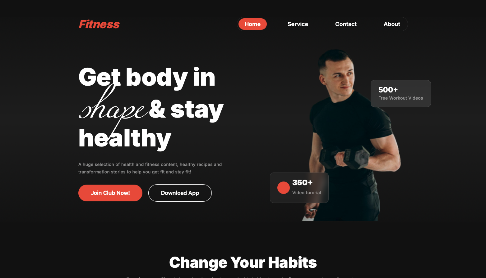

# Fitness Club


### 1. Project Overview
Fitness Club is a feature-rich website offering users a variety of fitness-related services, including workout programs, a BMI calculator, and expert guidance. The site is designed with a modern, responsive layout to ensure an optimal user experience on any device.

### 2. Live Project Link
https://rakibcodes36.github.io/assignment-02/


### 2. Screenshot
 

### 3. Technologies Used
- **Frontend:** HTML5, CSS3
- **Styling:** Google Fonts, Custom CSS
- **Icons & Images:** External Assets

### 4. Core Features
- Fully responsive fitness website
- Engaging UI/UX design with animations
- Mobile-friendly navigation with a hamburger menu
- BMI calculator to track body health
- Various workout plans and exercise guidance
- Professional trainers and services section
- Call-to-action buttons for joining the fitness club

### 5. Dependencies
- Google Fonts (Inter, Miama)
- External images and icons (Ensure paths are correct)

### 6. Installation & Local Setup
#### Step 1: Clone the Repository
```bash
 git clone https://github.com/your-username/fitness-club.git
```
#### Step 2: Navigate to the Project Directory
```bash
 cd fitness-club
```
#### Step 3: Open `index.html`
Simply open the `index.html` file in your browser to view the project locally.

### 7. Live Project Links & Resources
- [Live Demo](https://rakibcodes36.github.io/assignment-02/) 
- [GitHub Repository](https://github.com/rakibCodes36/assignment-02)

